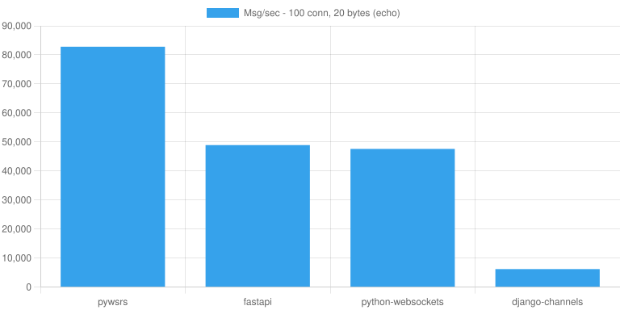

# Webrockets 🚀

[](https://pypi.org/project/webrockets/)
[](https://pypi.org/project/webrockets/)
[](https://github.com/ploMP4/webrockets/blob/main/LICENSE.md)

A high-performance WebSocket server for Python, with first-class Django support. The core server is implemented in Rust using PyO3 for maximum performance.

## Features

- **High-performance** - Rust-powered WebSocket server using axum and fastwebsockets
- **Django Integration** - Built-in authentication classes and management commands
- **Pattern Matching** - Route messages based on discriminator fields with optional Pydantic validation
- **Broadcasting** - Built-in support for Redis and RabbitMQ message brokers
- **Async Ready** - Supports both sync and async Python callbacks

## Performance

webrockets significantly outperforms other Python WebSocket implementations thanks to its Rust-powered core.



In a simple echo benchmark with 100 concurrent connections, webrockets achieves up to **10x higher throughput** compared to Django Channels with Daphne. See the [full benchmark results](https://webrockets.io/benchmarks/) for detailed comparisons across different scenarios.

## Installation

```bash
# Basic installation
pip install webrockets

# With Django integration
pip install webrockets[django]

# With Pydantic schema validation
pip install webrockets[schema]

# All extras
pip install webrockets[schema,django]
```

## Quick Start

```python
from webrockets import WebsocketServer

# Create a WebSocket server
server = WebsocketServer(host="0.0.0.0", port=8080)

# Create a route on the server
echo = server.create_route("ws/echo/", "echo")

@echo.connect("before")
def on_connect(conn):
    print(f"Client connected: {conn.path}")

@echo.receive
def on_message(conn, data):
    # Echo the message back
    conn.send(f"You said: {data}")

@echo.disconnect
def on_disconnect(conn, code=None, reason=None):
    print(f"Client disconnected: {code}")

server.start()
```

## Django Integration

webrockets provides seamless Django integration with built-in authentication support.

### Setup

Add `webrockets` to your `INSTALLED_APPS`:

```python
INSTALLED_APPS = [
    ...
    "webrockets",
]
```

Optionally configure the server in your settings:

```python
WEBSOCKET_HOST = "0.0.0.0"  # default
WEBSOCKET_PORT = 46290      # default
WEBSOCKET_BROKER = None     # or {"type": "redis", "url": "redis://localhost:6379"}
```

Create your WebSocket routes in a `websockets.py` file in any of your Django apps:

```python
# myapp/websockets.py
from webrockets.django import server
from webrockets.django.auth import SessionAuthentication

chat = server.create_route(
    "ws/chat/",
    "chat",
    authentication_classes=[SessionAuthentication()]
)

@chat.connect("before")
def on_connect(conn):
    print(f"User {conn.user} joined the chat")

@chat.receive
def on_message(conn, data):
    conn.send(f"{conn.user}: {data}")

@chat.disconnect
def on_disconnect(conn, code=None, reason=None):
    print(f"User {conn.user} left the chat")
```

Start the WebSocket server:

```bash
python manage.py runwebsockets
```

### Authentication Classes

webrockets includes several authentication classes following Django REST Framework patterns:

```python
from webrockets.django import server
from webrockets.django.auth import (
    SessionAuthentication,       # Django session-based auth
    CookieTokenAuthentication,   # Token from cookie
    HeaderTokenAuthentication,   # Token from header
    QueryStringTokenAuthentication,  # Token from URL query
)

# Use session auth (for browser clients)
chat = server.create_route("ws/chat/", "chat", authentication_classes=[
    SessionAuthentication()
])

# Custom token authentication
class MyTokenAuth(CookieTokenAuthentication):
    cookie_name = "ws_token"

    def validate_token(self, token):
        # Return user object or None
        return User.objects.filter(auth_token=token).first()
```

## Pattern Matching

Route messages based on JSON fields using the `Match` class:

```python
from pydantic import BaseModel
from webrockets import Match, WebsocketServer

class ChatMessage(BaseModel):
    type: str
    content: str
    room: str

server = WebsocketServer()
chat = server.create_route("ws/chat/", "chat")

# Match on a single key/value with Pydantic validation
@chat.receive(match=Match("type", "message"), schema=ChatMessage)
def on_chat(conn, data: ChatMessage):
    conn.broadcast([data.room], data.content)

# Match without schema - data is the raw JSON string
@chat.receive(match=Match("type", "ping"))
def on_ping(conn, data: str):
    conn.send('{"type": "pong"}')

# Fallback for unmatched messages
@chat.receive
def on_fallback(conn, data):
    conn.send("Unknown message type")
```
